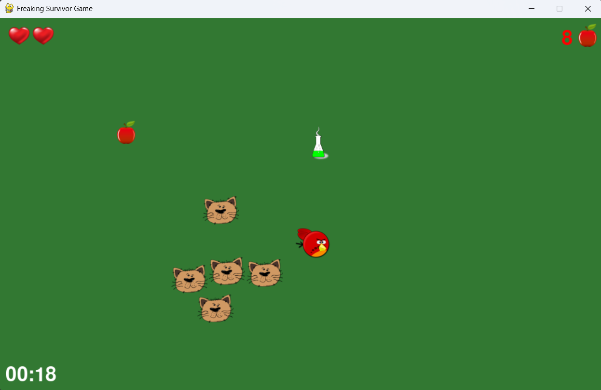

# Freaking Survivor Game

## 🎮 Description

**Freaking Survivor Game** is an action-packed survival game built using Python and Pygame.  
Navigate your player, collect apples to gain extra lives, avoid enemies, and grab power-up potions that grant special abilities like speed boosts, ghost mode, or clearing all enemies!

---

## ✨ Features

- Smooth 2D gameplay with player movement.
- Random enemy spawning with increasing difficulty.
- Collect apples to increase your score and earn extra lives.
- Collect potions to gain temporary power-ups.
- Pause, start, and game over screens with sound effects.
- Visual indicators for health, score, and power-up countdown.

---

## 📸 Screenshots



---

## 🛠 Installation

### Prerequisites

- Python 3.7 or higher (preferably 3.8+)
- [Pygame](https://www.pygame.org/)

### Install Pygame

```bash
pip install pygame
```

## ▶️ How to Run

1. Clone or download this repository:
```bash
git clone https://github.com/moh3n-rsl/freaking-survivor-game.git
cd freaking-survivor-game
```

2. Ensure your project folder looks like this:
```bash
freaking-survivor-game/
├── images/
│   ├── player_image.png
│   ├── enemy_image.png
│   ├── apple_image.png
│   ├── heart_image.png
│   ├── kill_all_potion_image.png
│   ├── ghost_mode_potion_image.png
│   └── speed_boost_potion_image.png
├── sounds/
│   ├── main_sound.mp3   ❌ (Do NOT upload copyrighted music)
│   ├── potion_pickup.wav
│   └── game_over.mp3
├── main.py
└── README.md
```
⚠️ Important: Remove or replace any copyrighted music.
Use royalty-free or Creative Commons music instead.

3. Run the game:
```bash
python main.py
```

## 🎮 Controls

- W, A, S, D — Move player up, left, down, right.

- P — Pause and resume the game.

- Any key — Start or restart the game (from the start/gameover screen).

## 📦 Dependencies

- Pygame — Handles graphics, input, audio, and game logic.

## 📄 Notes
- This game requires images and sounds to be inside the correct folders to work properly.

- Game difficulty increases over time.

- Power-ups last for 5 seconds.

- Collect 20 apples to earn an extra heart.

- Game assets (music, sounds, images) must be properly licensed.

